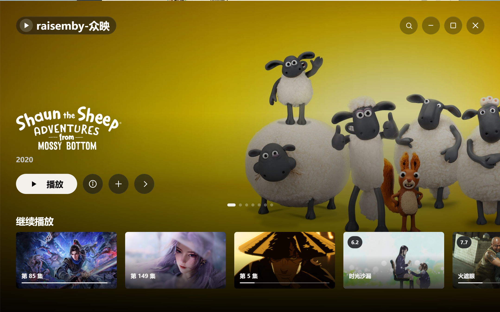
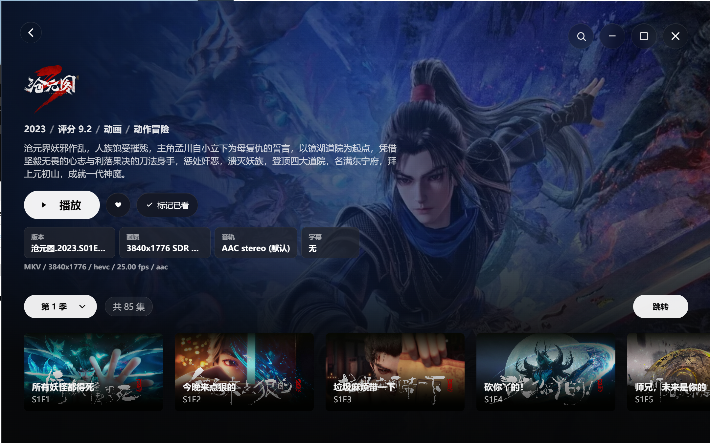
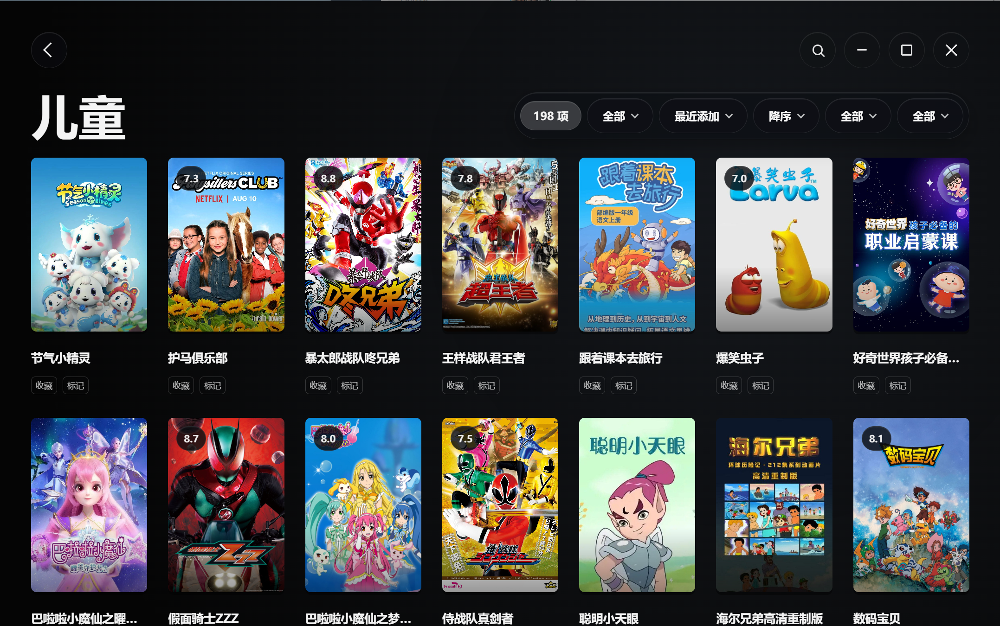

<div align="center">
  <h1>Zplayer</h1>
  <p><strong>A polished desktop client for Emby and Jellyfin, powered by libmpv.</strong></p>
  <p>
    
    
    
    
    
  </p>
  <p>
    
  </p>
</div>

## Overview

Zplayer brings an Emby or Jellyfin media library into a native desktop app. It focuses on fast library browsing, cinematic media pages, and reliable libmpv playback with server progress reporting.

<table>
  <tr>
    <td width="33%"><strong>Library first</strong><br><sub>Home shelves, favorites, continue watching, library filters, search, and server switching.</sub></td>
    <td width="33%"><strong>Playback first</strong><br><sub>libmpv playback with resume, progress sync, audio/subtitle selection, speed, volume, and next episode controls.</sub></td>
    <td width="33%"><strong>Desktop first</strong><br><sub>Tauri shell, Rust backend, configurable libmpv path, proxy behavior, cache settings, themes, and diagnostics.</sub></td>
  </tr>
</table>

## Screenshots

<table>
  <tr>
    <td width="50%">
      
      <br>
      <strong>Rich media details</strong>
      <br>
      <sub>Artwork, seasons, episodes, people, related titles, and source metadata in one place.</sub>
    </td>
    <td width="50%">
      
      <br>
      <strong>Focused playback</strong>
      <br>
      <sub>Clean controls for seeking, audio, subtitles, volume, speed, and episode flow.</sub>
    </td>
  </tr>
</table>

## Highlights

| Area | What Zplayer provides |
| --- | --- |
| Servers | Add, test, switch, and manage Emby or Jellyfin connections. |
| Home | Recommendations, latest media, resume rows, recent plays, favorites, and library shelves. |
| Libraries | Type filters, sorting, played/unplayed state, favorites, genres, and poster density options. |
| Details | Seasons, episodes, cast and crew, artwork, similar titles, and media source inspection. |
| Playback | libmpv-backed streaming, resume support, progress reporting, subtitle and audio controls, and autoplay next episode. |
| Settings | Language, theme, cache, diagnostics, seek steps, default volume, subtitles, proxy behavior, and custom libmpv path. |

## Quick Start

### Prerequisites

- Node.js and npm
- Rust and the Tauri toolchain
- bundled or system libmpv for playback

### Run locally

```bash
npm install
npm run tauri -- dev
```

### Build

```bash
npm run tauri -- build
```

## Runtime Notes

| Platform | libmpv requirement |
| --- | --- |
| Windows | Packaged builds load `libmpv/windows-x86_64/libmpv-2.dll`. |
| Linux | Package `libmpv/linux-x86_64/libmpv.so.2`, install system libmpv, or configure a custom libmpv path in settings. |
| macOS | Package `libmpv/macos-universal/Mpv.xcframework/.../Mpv`, install system libmpv, or configure a custom libmpv path in settings. |

## Tech Stack

Zplayer uses Tauri for the desktop shell, React and TypeScript for the interface, Rust for native integration and server communication, and libmpv for media playback.
